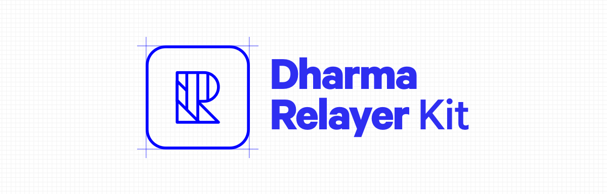

The Dharma Relayer Kit is the definitive starting point for building a business on top of [Dharma Protocol](https://dharma.io/).

The Relayer Kit lets anyone become a crypto entrepreneur in just a few steps. No bank account required.

Getting started is simple:

-   👩‍💻 Fork the repo
-   🎨 Define your own style with our unopinionated React components
-   🚀 Deploy to Heroku
-   💸 Collect real cryptocurrency through relayer fees

The Dharma Relayer Kit allows you &mdash; the entrepreneur &mdash; to focus on your business, and not the blockchain.

<!-- START doctoc generated TOC please keep comment here to allow auto update -->
<!-- DON'T EDIT THIS SECTION, INSTEAD RE-RUN doctoc TO UPDATE -->

# Table of Contents

-   [Getting Started](#getting-started)
    -   [Clone](#clone)
    -   [Dependencies](#dependencies)
    -   [Blockchain](#blockchain)
    -   [Backend](#backend)
    -   [Frontend](#frontend)
-   [Running on the Kovan Testnet](#running-on-the-kovan-testnet)
    -   [Securing dummy tokens](#securing-dummy-tokens)
    -   [Build your app](#build-your-app)
    -   [Understand the NETWORK environment variable](#understand-the-network-environment-variable)
    -   [Run the app](#run-the-app)
-   [Deployment](#deployment)
    -   [Create a new Heroku app](#create-a-new-heroku-app)
    -   [Push your repo to Heroku](#push-your-repo-to-heroku)
    -   [Open your new relayer on Heroku](#open-your-new-relayer-on-heroku)
-   [Troubleshooting](#troubleshooting)
    -   [I'm getting an error that blockchain failed to start](#im-getting-an-error-that-blockchain-failed-to-start)
-   [FAQ](#faq)
    -   [What is Dharma?](#what-is-dharma)
    -   [What is a Dharma Relayer?](#what-is-a-dharma-relayer)
    -   [Why start a Dharma Relayer?](#why-start-a-dharma-relayer)
    -   [How does a Dharma Relayer make money?](#how-does-a-dharma-relayer-make-money)
    -   [Are there existing Dharma Relayers?](#are-there-existing-dharma-relayers)
    -   [Are all Dharma Relayers the same?](#are-all-dharma-relayers-the%C2%A0same)
    -   [What is the approval process for becoming a Dharma Relayer?](#what-is-the-approval-process-for-becoming-a-dharma-relayer)
    -   [What technical skills are required to operate a Dharma Relayer?](#what-technical-skills-are-required-to-operate-a-dharma-relayer)
    -   [Do I need to conform to any specific branding when launching a Dharma relayer?](#do-i-need-to-conform-to-any-specific-branding-when-launching-a-dharma-relayer)

<!-- END doctoc generated TOC please keep comment here to allow auto update -->

# Getting Started

We made getting started fast, simple and fun.

## Clone

Clone the repo to your workstation:

```
git clone https://github.com/dharmaprotocol/relayer-starter-kit.git
```

## Dependencies

To run the project, you'll first need to install the dependencies:

```
yarn
```

## Blockchain

And launch a local blockchain via:

```
yarn blockchain
```

## Backend

And launch the server via:

```
yarn server
```

## Frontend

And launch the React frontend via:

```
yarn start
```

# Running on the Kovan Testnet

Kovan is a test blockchain (referred to as a "testnet") for Ethereum smart contracts.

The Dharma team has deployed our contracts to the Kovan testnet so developers building on top of Dharma can simulate their apps running in production &mdash; without the need to use real tokens.

## Securing dummy tokens

You can secure dummy tokens for use on the Kovan testnet via [https://wallet.dharma.io](https://wallet.dharma.io). Be sure to set your MetaMask to Kovan.

## Build your app

First, build a "production" version of your app:

```
yarn build
```

## Understand the NETWORK environment variable

We use an environment variable to allow the server to specify a different database for your
Kovan Loan Requests - since Loan Requests for one blockchain will not be valid for another (e.g., addresses will differ).

The environment variable we modify is `NETWORK=kovan` (and likewise `NETWORK=mainnet` for mainnet).

## Run the app

Run your app by specifying the Kovan network before initiating the server:

```
NETWORK=kovan yarn server
```

This will run a server on port 8000, alongside your frontend application.

Visit your app on this server by visiting [http://localhost:8000](http://localhost:8000).

Note: Changes you make to your app won't be reflected immediately when developing in this state.
You'll need to rebuild your app and then restart your server to see changes.

# Deployment

Everything you need to deploy to Heroku is baked into this repo.

In your command line, make sure you're logged into heroku, and then enter the following commands:

## Create a new Heroku app

If you are logged into Heroku on your command line, you can simply run:

```
heroku create
```

Otherwise, follow the instructions Heroku provides for [creating a new Heroku app](https://devcenter.heroku.com/articles/creating-apps).

## Push your repo to Heroku

```
git push -f heroku master
```

## Open your new relayer on Heroku

```
heroku open
```

# Troubleshooting

You can use this section to debug any problems you might run into while setting up your relayer.

## I'm getting an error that blockchain failed to start

In order to run a local blockchain (via `yarn blockchain`), we use a tool called [Ganache-CLI](https://github.com/trufflesuite/ganache-cli).

This requires that we install Ganache-CLI first, which sometimes requires extra permissions
(depending on your computer's setup).

Note: There is no strict requirement to use our blockchain setup - if you like, you can do all of your
development against the Kovan testnet, where our contracts are deployed. The preconfigured local blockchain is
just for quicker development.

If you're having trouble with running the local blockchain, we recommend you consult the Ganache-CLI setup
page (https://github.com/trufflesuite/ganache-cli) and try to get that running first, and then try running `yarn blockchain` in your relayer project again.

If you're comfortable doing so, then to get around the permissions problem you might end up using your
computer's "root" permissions to install Ganache-CLI, by running:

```
sudo npm install -g ganache-cli@6.1.3
```

# FAQ

## What is Dharma?

Dharma is a suite of developer tools and infrastructure that make it easy to build blockchain-based lending applications. Read more [here](https://dharma.io/).

## What is a Dharma Relayer?

A Relayer is a source of liquidity on the Dharma network. It connects borrowers with lenders.

You can think of it as a bulletin board where individuals connected on the Internet can post requests to borrow money.

## Why start a Dharma Relayer?

We imagine a world in which the majority of financial transactions occur on globally accessible blockchains.

In this new world, being a Relayer is akin to an early internet entrepreneur, providing a valuable service on the frontiers of the new economy.

## How does a Dharma Relayer make money?

Relayers earn a fee every time a loan is filled on their site. The fee is some percentage of the principal amount as determined by the Relayer. Once the transaction has been recorded on the blockchain, the Dharma protocol automatically transfers the fee to the Relayer's address.

## Are there existing Dharma Relayers?

While starting a Relayer is an intrepid task, you won't be alone. [Bloqboard](https://dapp.bloqboard.com/) launched earlier this year and has since gone on to raise a round of financing from esteemed investors in the crypto space.

## Are all Dharma Relayers the same?

We envision the Dharma ecosystem supporting many relayers &mdash; with individual relayers developing brands associated with their particular area of focus or domain expertise.

For example, a Relayer could specialize in micro-finance, venture debt, or margin trading.

While these markets might be modest today &mdash; over time, more and more financial transactions will take place on the blockchain, offering more and more opportunity for Relayers to grow their businesses.

## What is the approval process for becoming a Dharma Relayer?

There is no approval process for launching a Dharma Relayer. You can launch whenever you want. Dharma is **live** on the Ethereum mainnet today.

## What technical skills are required to operate a Dharma Relayer?

To build a Relayer, the only programming language necessary is JavaScript.

## Do I need to conform to any specific branding when launching a Dharma relayer?

In designing the Relayer Kit, we intentionally left out any opinionated branding so that you, the entrepreneur, can conceive of and implement your own brand.

We imagine there being many relayers, each differentiated by the market they serve and the brand they build.
